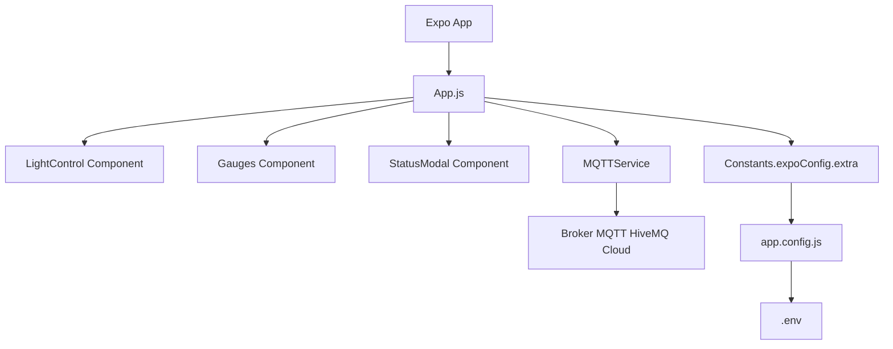
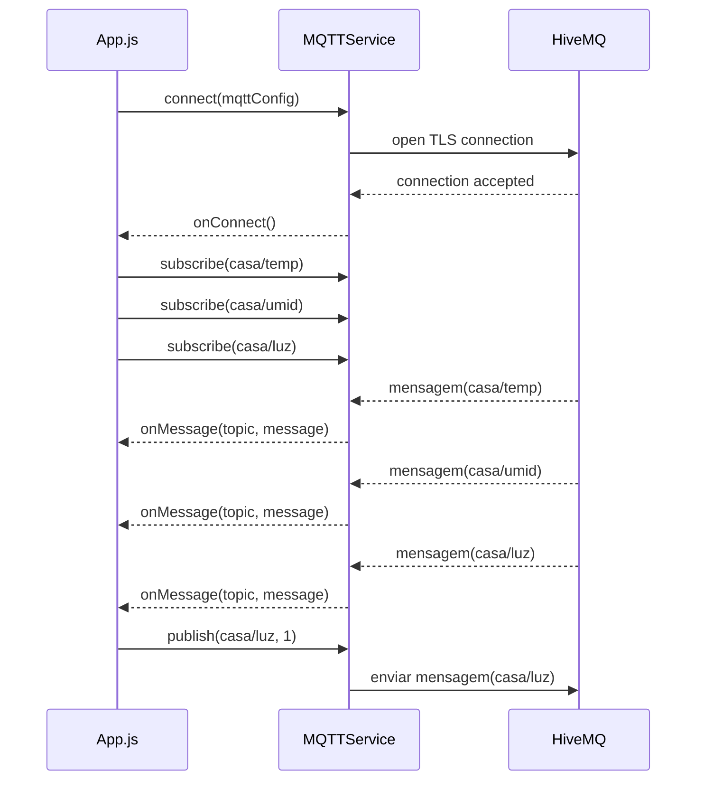

# MyIoTProject

Aplicativo móvel React Native Expo para monitoramento e controle de dispositivos IoT via MQTT.

## Visão Geral

O `MyIoTProject` conecta-se a um broker MQTT (HiveMQ Cloud), lê dados de temperatura e umidade e permite alternar uma lâmpada virtual.

### Funcionalidades principais

- Conexão MQTT com broker HiveMQ Cloud
- Leitura em tempo real dos tópicos:
  - `casa/temp`
  - `casa/umid`
  - `casa/luz`
- Exibição de temperatura e umidade com gauges circulares
- Controle da lâmpada por toque na interface
- Modal de erro de conexão para retry
- Estrutura modular com componentes React separados

## Estrutura do Projeto

- `App.js` - ponto de entrada do app e lógica principal de conexão MQTT
- `app.config.js` - configuração Expo que carrega variáveis de ambiente do `.env`
- `.env.example` - exemplo de variáveis de ambiente necessárias
- `src/services/mqttService.js` - serviço MQTT com `react_native_mqtt`
- `src/components/LightControl.js` - componente da lâmpada
- `src/components/Gauges.js` - componente dos gauges de temperatura e umidade
- `src/components/StatusModal.js` - modal de status de conexão

## Requisitos

- Node.js
- npm
- Expo CLI (opcional, mas recomendado)
- Conexão com broker MQTT compatível com TLS/SSL

## Configuração

1. Clone o projeto:

```bash
git clone <url-do-repositorio>
cd MyIotProject
```

2. Instale dependências:

```bash
npm install
```

3. Crie o arquivo `.env` a partir de `.env.example`:

```bash
cp .env.example .env
```

4. Preencha as variáveis de ambiente:

```env
MQTT_HOST=seu_broker_hivemq.cloud
MQTT_PORT=8884
MQTT_PATH=/mqtt
MQTT_USER=seu_usuario
MQTT_PASS=sua_senha
```

> O arquivo `.env` não deve ser versionado e já está protegido pelo `.gitignore`.

## Execução

Use os scripts disponíveis em `package.json`:

```bash
npm start
npm run android
npm run ios
npm run web
```

## Configuração de ambiente no Expo

O projeto usa `app.config.js` e `dotenv` para carregar variáveis do `.env` e expô-las para o app:

- `app.config.js` importa `dotenv/config`
- `Constants.expoConfig.extra` é usado em `App.js`

Isso evita dependências inválidas como `expo-env` e permite manter credenciais fora do código-fonte.

## Como o App funciona

1. `App.js` inicializa uma instância de `MQTTService`
2. `startConnection()` conecta ao broker com os dados do `.env`
3. Quando conectado, o app se inscreve nos tópicos `casa/temp`, `casa/umid` e `casa/luz`
4. Mensagens MQTT atualizam os estados `temp`, `hum` e `isLightOn`
5. `toggleLight()` publica `0` ou `1` no tópico `casa/luz`

## Diagrama de Arquitetura



## Fluxo MQTT



## Partes 1 e 2

### Parte 1 - Conexão e comunicação MQTT

Nesta etapa o foco é configurar e testar a comunicação com o broker MQTT:

- Configurar `.env` com credenciais do broker
- Garantir que `app.config.js` esteja carregando as variáveis corretas
- Conectar ao broker usando `MQTTService`
- Inscrever-se nos tópicos MQTT relevantes
- Tratar falhas de conexão com modal de erro

### Parte 2 - Interface e componentes

Nesta etapa o foco é deixar o app modular e visualmente organizado:

- Extrair a seção da lâmpada para `src/components/LightControl.js`
- Extrair a seção dos gauges para `src/components/Gauges.js`
- Manter `App.js` mais leve e focado na lógica de estado e conexão
- Usar `StatusModal` para feedback de erro

## Observações

- O broker deve aceitar conexões TLS/SSL e o app utiliza `useSSL: true` no `MQTTService`
- Se o app não conectar, verifique:
  - credenciais MQTT
  - host/porta/path corretos
  - regras de firewall/rede
- Use um dispositivo físico ou emulador com rede ativa

## Dependências principais

- `expo`
- `react-native`
- `react_native_mqtt`
- `react-native-circular-progress-indicator`
- `react-native-svg`
- `react-native-vector-icons`
- `dotenv`

## Extras

- `index.js` registra `App` como root component do Expo
- `.gitignore` já exclui `node_modules`, `.expo/`, `.env*.local` e arquivos nativos gerados

---

Se você quiser, posso também adicionar um diagrama rápido de fluxo MQTT ou instruções de deploy para Android/iOS.